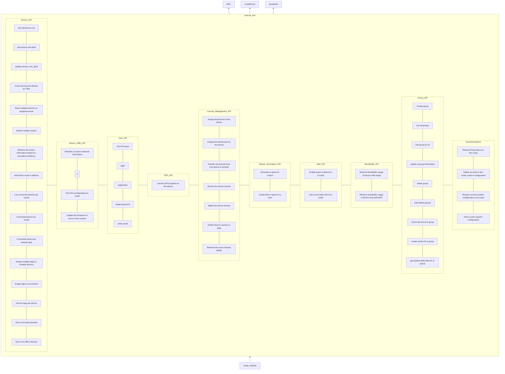

```mermaid
flowchart BT
    Internal_API-->BEC
    Internal_API-->CradlePoint
    Internal_API-->ReadyNet
    amop_website --> Internal_API

    subgraph Internal_API
        direction LR
        Device_API
        ---Device_CMD_API
        ---User_API
        ---GPS_API
        ---License_Management_API
        ---Report_Generation_API
        ---Alert_API
        ---Bandwidth_API
        ---Group_API
        ---Synchronizations
    end

    subgraph Device_API
         direction TB
         Get-All-Device-List
         ---Get-Device-Info-ById
         ---Update-Device_Info_ById
         ---Count-DeviceLists-Based-on-Filter
         ---Move-multiple-devices-to-assigned-owner
         ---Delete-multiple-routers
         ---Retrieve-all-routers-information-based-on-provided-conditions
         ---Add-Edit-a-router's-address
         ---List-connected-devices-by-carrier
         ---Connected-device-by-model
         ---Connected-device-by-network-type
         ---Assign-multiple-tags-to-multiple-devices
         ---Assign-tags-to-one-device
         ---Get-the-tags-per-device
         ---Get-no-of-online-devices
         ---Get-no-of-offline-devices
    end

    subgraph Device_CMD_API
         direction TB
         Retrieve-a-router's-network-information
         ---Send-reboot-command-to-router(s)
         ---Push-the-configuration-to-router
         ---Update-the-firmware-of-one-or-more-routers
    end

    subgraph User_API
         direction TB
         Get-API-Keys
         ---login
         ---registration
         ---forget-password
         ---verify-email
    end

    subgraph GPS_API
         direction TB
         Get-the-GPS-location-of-the-device
    end

    subgraph License_Management_API
         direction TB
         Assign-the-license-to-the-device
         ---Assign-the-bulk-license-to-the-device
         ---Transfer-the-license-from-one-device-to-another
         ---Renew-the-device-license
         ---delete-the-device-license
         ---Delete-device-License-in-Bulk
         ---Retrieve-the-user's-license-details
    end

    subgraph Report_Generation_API
         direction TB
         Generate-a-report-of-routers
         ---Create-Edit-a-report-of-a-user
    end

    subgraph Alert_API
         direction TB
         Enable-types-of-alerts-for-a-router
         ---Get-current-alert-info-of-a-router
    end

    subgraph Bandwidth_API
         direction TB
         Retreive-bandwidth-usage-of-device-with-range
         ---Retreive-bandwidth-usage-of-device-only-with-MAC
    end

    subgraph Group_API
         direction TB
         Create-group
         ---Get-all-groups
         ---Get-group-by-Id
         ---update-a-group-information
         ---delete-gorup
         ---bulk-delete-groups
         ---Count-devices-of-a-group
         ---create-a-plan-for-a-group
         ---get-update-delte-plan-for-a-group
    end

    subgraph Synchronizations
         direction TB
         Retrieve-Ping-status-on-the-router
         ---Delete-an-entry-in-the-router-system-configuration
         ---Retrieve-current-system-configuration-of-a-router
         ---Edit-a-router-system-configuration
    end
```
